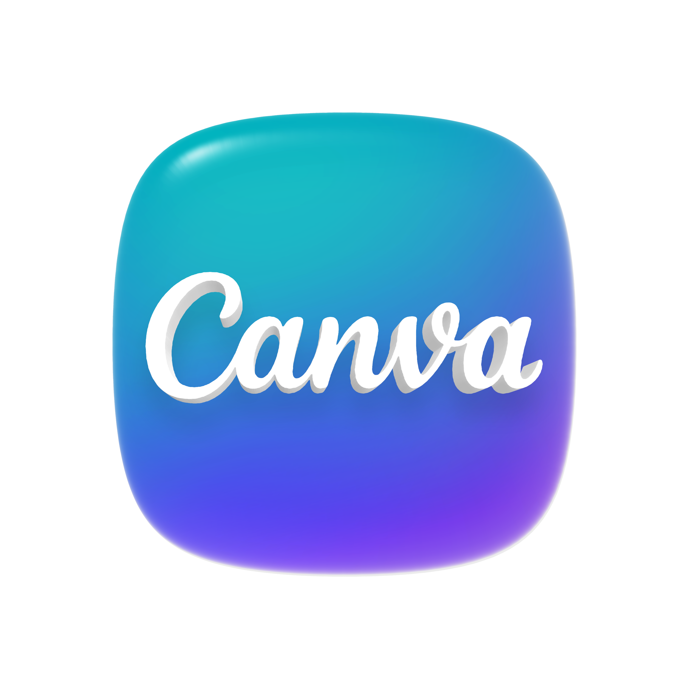

# 🥇 Champion CUEE 3rd 🥇
งานนี้จัดขึ้นโดย ภาควิชาวิศวกรรมไฟฟ้า คณะวิศวกรรมศาสตร์ จุฬาลงกรณ์มหาวิทยาลัย ระหว่างวันที่ 7-22 มีนาคม 2569

**สมาชิก Group 10 -  ป.**
1. ณัฐพัชร์ พูนแสงศิริ (นัท)
2. อรอินทุ์ เบญจบริรักษ์กุล (ผักกาด)
3. พงษภัสภ์ คณะฤทธิ์สุไชย (คิว)
4. ชื่นนภา เก็งวินิจ (พิงค์)
5. กันตวัฒน์ วงศ์โรจน์ปชากุล (ซิน)

---

## THEME : (IoT) for Smart Living

### ชื่อโปรเจกต์ : Smart Office System
เป็นระบบตรวจสอบ พฤติกรรมการทำงานของพนักงานแบบ Real-time เช่น ระยะห่างจากจอ ท่านั่ง ระยะเวลาการทำงาน แสงสว่าง เพื่อป้องกันการเกิด Office Syndrome พร้อมส่งข้อมูลไปวิเคราะห์ผ่าน IoT (ระบบช่วยพัฒนาสภาพแวดล้อมในการทำงานเพื่อการทำงานที่ดีต่อสุขภาพ และมีคุณภาพ)

### ที่มาของปัญหา 
Office Syndrome เป็นปัญหาที่เกิดได้กับทุกคน โดยเฉพาะคนที่ใช้คอมพิวเตอร์และต้องนั่งทำงานเป็นเวลานานๆ

### ส่งผลทำให้เกิดปัญหา  
ปวดคอ/ปวดหลัง/ปวดไหล่/สายตาเสีย → ก่อให้เกิดปัญหาตามมาได้ เช่น ต้องได้รับการรักษา ต้องใส่แว่น ส่งผลต่อคุณภาพชีวิตโดยรวม

### ปัญหาเกิดที่ไหน? 
work space ของ user ไม่ว่าจะเป็น ออฟฟิศ/ห้องเรียน/ห้องทำงานที่บ้าน

## สาเหตุหลัก
|ปัจจัยจากการนั่งทำงานจนลืมตัวของ  user|ปัจจัยจากสภาพโดยรอบ|
|:----:|:----:|
| 1. นั่งใกล้จอเกินไป   | 1. แสงสว่างไม่พอ |
| 2. นั่งหลังงอ  | 2. จอคอมสว่างเกิน |
| 3. ทำงานนานเกินไป |

## วิธีแก้แบบเดิม
**นวัตกรรมต่าง ๆ ที่ถูกสร้างขึ้นมามีหลายอย่างเช่น**
|ชื่อ|หน้าที่|ข้อเสีย|
|:----:|:----:|:----:|
|ผ้ารัดหลัง | ทำหน้าที่รั้งหลังของ user ให้สรีระคงที่ ลดการนั่งหลังงอ | อึดอัด และยังนั่งหลังงอได้อยู่ถ้าลืมตัว (จากคนใช้จริง)|
|ใช้การตั้งเวลาในการเตือนให้ยืดเส้นยืดสาย | ระบบนี้มีใน smart watch ช่วยแก้ปัญหานั่งทำงานนาน | แก้ได้อย่างเดียว อาจจะไม่คุ้ม|
|แว่นกรองแสง | แก้ปัญหาการปวดตาจากแสงจอคอม | กันได้ไม่ทั้งหมด สุดท้ายสภาพแวดล้อมที่เหมาะสมก็สำคัญกว่าอยู่ดี|

## หลักการและแนวทางแก้ปัญหา 
เราต้องการสร้าง พื้นที่ทำงานอัจฉริยะ ที่จะพัฒนาสภาพแวดล้อมในการทำงาน เพื่อการทำงานที่ดีต่อสุขภาพและมีคุณภาพ โดยการสังเกตุจาก user และสภาพแวดล้อมโดยรอบ จากการตรวจจับต่าง ๆ พร้อมทั้งใช้ข้อมูลนั้นในการพัฒนาคุณภาพการทำงานของ USER ต่อไป

## โดยจะมีระบบดังนี้
|Boardที่|ชื่อBoard|หน้าที่|
|:----:|:----:|:----:|
|Board 1 หน่วยประมวลผลและแจ้งเตือน (Receiver) | ESP32-WROOM | รับข้อมูลจาก Board 2 + ประมวลผล + แจ้งเตือน (LCD / LED / Buzzer)|
|Board 2 หน่วยประมวลผลและส่ง (Sender) | ESP8266 | อ่าน Ultrasonic 2 ตัวจากเก้าอี้ แล้วส่งค่าไปให้ Board 1 ผ่าน ESP-NOW|

|โปรโตคอล|Logic|Output|
|:----:|:----:|:----:|
| ESP-NOW Communication | Board 2 ส่ง struct BackData {distUp, distLow} ไปหา ESP32 ทุก 500ms | Board 1 รับค่า → ใช้ตรวจ “ท่านั่ง” และ “การนั่ง” |

|ส่วนที่|ฟังก์ชั่น|Logic|Output|
|:----:|:----:|:----:|:---:|
| 1 | การตรวจจับระยะหน้าจอ (Screen Distance Warning System) | ใช้ Ultrasonic (TRIG_EYE/ECHO_EYE) วัดระยะจาก Ultrasonic หน้าเครื่อง ถ้า < 40 cm และค้างเกิน 3 วิ | Buzzer ดัง "ติ๊ดเร็ว" (BT_EYE), LED Alert 2 ติด, และ LCD ขึ้นเตือน Too Close|
| 2 | การตรวจจับท่านั่งหลังงอ (Posture Check Warning System) | รับ distUp/distLow จาก Board 2 ถ้า (distUp - distLow) > 15 cm และค้างเกิน 5 วิ → หลังงอ | Buzzer ดัง "ติ๊ด 2 ที" (BT_HUNCH), LED Alert 2 ติด, และ LCD ขึ้นเตือน Bad Posture|
| 3 | ตรวจจับแสงสว่าง (Light Monitoring system) | ใช้ TEMT6000 อ่านค่า Analog (Pin 34) แล้วแปลงเป็น lux ถ้า < 500 | LED Alert 3 ติด และ LCD ขึ้นเตือน Low Light (ไม่มีเสียงเตือน) |
| 4 | การนับเวลาทำงานและคนนั่ง (stretch reminds system) | ถ้า distLow < 50 → มีคนนั่ง และถ้านั่งเกิน 60 นาที | Buzzer ดัง "ติ๊ดยาว" (BT_WORK) และ LCD ขึ้นเตือน Take a break (ไม่มีLED) หมายเหตุ: มีการเก็บเวลารวมสะสมไว้ใน totalWorkAccumulated แม้จะลุกไปแล้วกลับมานั่งใหม่ |
| 5 | ปุ่มระบบ (System Control) | ใช้ Pin 27 ควบคุมการเปิด/ปิดระบบทั้งหมด | LED System (Pin 2) จะติดเมื่อระบบพร้อมทำงาน + (LCD “Monitoring” + beep สั้น เพื่อทดสอบ) |

## แต่ละส่วน จะมีเสียงbuzzerต่างกัน และมีการเรียงpiority output ไปlcd 1=สำคัญสุด
|ระดับPiority|เหตุการณ์|Output Buzzer|Output lcd|
|:----:|:----:|:----:|:----:|
| 1 | ใกล้หน้าจอ | ติ๊ดเร็ว 1 ที | Too Close , Move back pls|
| 2 | หลังงอ | ติ๊ด 2 ที | Bad Posture , Sit straight|
| 3 | นั่งนานเกินไป | ติ๊ดยาว | Take a break , 1hr work done|
| 4 | แสงน้อย| ไม่มีเสียง | Low Light , Check lighting|

ถ้าไม่เข้าเงื่อนไขข้างต้น lcd จะขึ้นว่า Status: OK , "All good :)

## ผลที่คาดว่าจะได้
|ด้านสุขภาพ|ด้านการทำงาน|
|:----:|:----:|
| ลดความเสี่ยง / ปวดหลัง / ปวดคอ | ช่วยให้ผู้ใช้งานสามารถนั่งทำงานใน ท่าทางที่ถูกต้อง  ประยุกต์ใช้ได้จริงในสถานที่ต่าง ๆ เช่น  สำนักงาน  ห้องทำงานที่บ้าน มีการพักสายตาเป็นระยะ ทำให้ ลดความเหนื่อยล้า เพิ่มประสิทธิภาพในการทำงานได้ ช่วยให้ผู้ใช้งานตระหนักถึงพฤติกรรมการนั่งทำงานของตนเองมากขึ้น |

## ส่วนสถิติ การนำ Data ไปใช้
เก็บข้อมูลรายวันและ สรุปผลว่าควรปรับอะไร
    
    ตัวอย่างสรุปสถิติรายวันที่จะส่งไปใน Line Notification
    
    Work time: 6 hr
    Bad posture: 25
    Too close to screen: 40 min

## v รายละเอียดเพิ่มเติม v
| Icon | ชื่อ | ลิ้ง |
|:----:|:----:|:----:|
|| Canva | [จิ้มตรงนี้เลย](https://www.canva.com/design/DAHEXT_p398/ee_kmW8PMvK5iHlWvznw_Q/edit) |
|| Notion | [จิ้มตรงนี้เลย](https://www.notion.so/CUEE-camp-3rd-Project-32446d96d54180bd9ff4f5083bba8f63) |
|| Onshape (3D) | [จิ้มตรงนี้เลย](https://cad.onshape.com/documents/c8f79d7ed01564a4cec14bf9/w/396719e0328e4afdfa772147/e/2ed5f0de6a59f7741a7d899d) |

